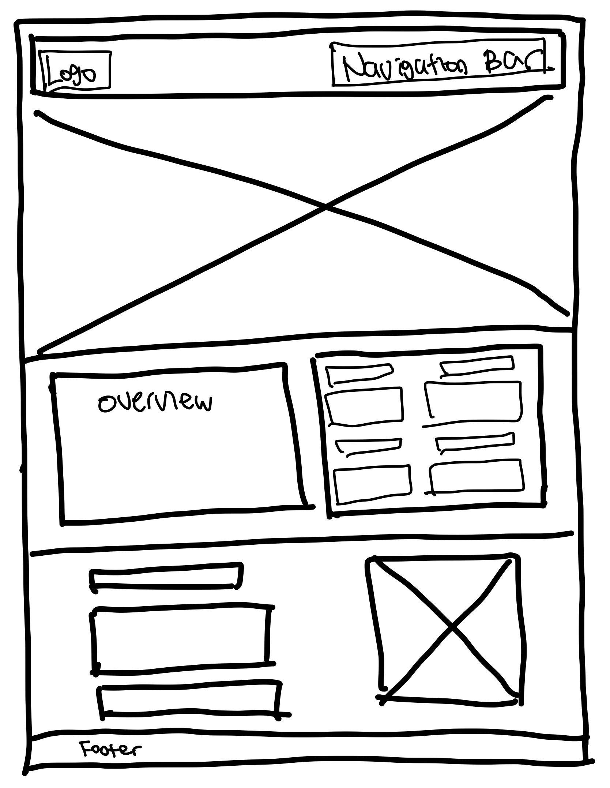

# Citation Portfolio Page 

**Title**: Citation Portfolio  
**Date**: 29 Jan 2022  
**Deliverable**: CSS/HTML Webpage  

For week 1, I learnt how to create a static webpage using HTML and CSS. For the assignment, I created a portfolio webpage for my most recent game prdouction project - Citation. Citation is an interactive game that supports NYU students to learn academic integrity concepts.

[Access Project Here](https://github.com/Soojin-Lee0819/connectionsLab/blob/main/Week1/Application-Review.md)

### WireFrame 

1. Header (Logo + Navigation Bar)
2. Section-1 (Image with a title)
3. Section-2 (Overview on the left and project description grid on the right)
4. Section-3 (Content)
5. Footer (copyright)

---

### Page Screenshot

---

### Process

I started with the header. On the right, there is my logo, also a link to the "homepage". Although it is a single page website, I added navigation bar with the list of links to multiple pages. On hover, the logo reduces it's opacity and the link texts change color. This was added to give more feedback to the users.  

For the font sizes, I used vw to keep my design consistent on all browsers and make it responsive to different devices.  

For the section-2-overview making a 4-box-grid-system was challenging. I leanrt how to use **grid-template-columns** and **grid-template-rows** to adjust the grid template. I still need to improve my skills on grid system. I want to learn how to make customized grid with various cell sizes.  

For the content part (background, UX design, Playtesting ...), I downloaded portolio I created on figma and uploaded to the website as images. This way, I could display more customized design and add graphs easily.  

